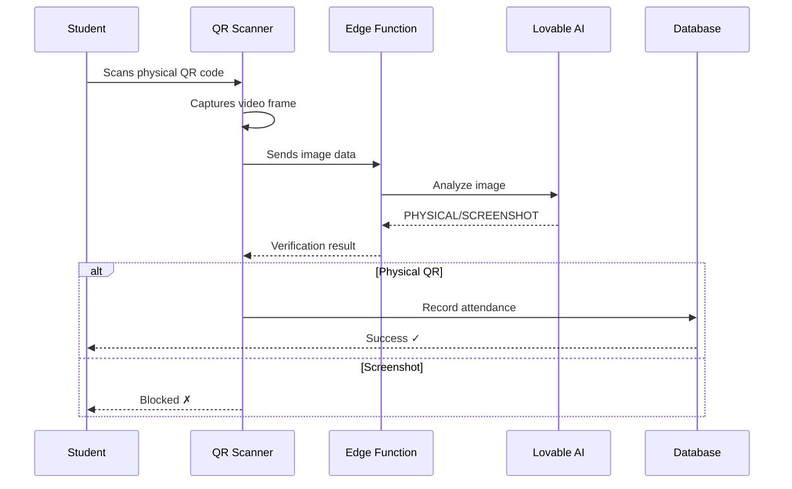

# TeachCompanion

A modern, AI-powered Learning Management System (LMS) designed to streamline course management, automate attendance tracking, and reduce teaching assistant workload through intelligent automation.

## 🎯 Project Overview

TeachCompanion addresses critical challenges in university course management:

- **Reduces TA workload** by automating grading workflows and attendance tracking
- **Prevents attendance fraud** using AI-powered physical QR code verification
- **Streamlines course administration** with role-based access control and intuitive interfaces
- **Provides real-time analytics** for course performance and student engagement

The system supports three distinct user roles (Teachers, Teaching Assistants, and Students), each with tailored interfaces and permissions enforced through robust security policies.

## ✨ Key Features

### 🔐 Role-Based Access Control (RBAC)
- **Teachers**: Full course management, assignment creation, TA assignment, analytics access
- **Teaching Assistants (TAs)**: Course-specific grading, attendance monitoring, student management
- **Students**: Course enrollment, assignment submission, attendance tracking

### 🤖 AI-Powered Attendance Verification
- **Physical QR Detection**: Leverages Lovable AI (Google Gemini 2.5 Flash) to distinguish physical QR codes from screenshots
- **Single-Scan Process**: Students scan once with real-time AI verification
- **Anti-Fraud Protection**: Rotating QR tokens (2-second refresh) + AI image analysis prevents screenshot sharing

### 📚 Course Management
- Manual enrollment system for controlled access
- Multi-course support with department organization
- Teacher and TA role assignment per course
- Course-specific exercise sessions and assignments

### 📝 Assignment & Grading System
- Teachers create assignments with file attachments and question sets
- Students submit assignments with file uploads
- TAs grade submissions with per-question marking
- Real-time grading analytics and progress tracking

### 📊 Analytics Dashboard
- Course enrollment statistics
- Assignment completion rates
- Attendance tracking and trends
- Student performance metrics

### 🔄 Exercise Session Management
- QR-based attendance for in-person sessions
- Recurring session scheduling support
- Real-time attendance monitoring
- Session history and reporting

## 🛠️ Technology Stack

### Frontend
- **Framework**: React 18 with TypeScript
- **Build Tool**: Vite
- **Styling**: Tailwind CSS with custom design system
- **UI Components**: shadcn/ui + Radix UI primitives
- **Routing**: React Router v6
- **State Management**: React Query (@tanstack/react-query)
- **QR Code**: html5-qrcode library
- **Charts**: Recharts

### Backend (Lovable Cloud)
- **Database**: PostgreSQL (via Supabase)
- **Authentication**: JWT-based auth with email/password
- **Storage**: Supabase Storage (assignment files, submissions)
- **Edge Functions**: Deno-based serverless functions
- **Real-time**: Supabase Realtime subscriptions

### AI Integration
- **Provider**: Lovable AI Gateway
- **Model**: Google Gemini 2.5 Flash
- **Use Case**: Physical QR code verification (screenshot detection)

## 🏗️ Architecture

### Database Schema

```
courses
├── id (uuid, PK)
├── name (text)
├── department (text)
├── dates (text)
└── created_at (timestamp)

course_enrollments
├── id (uuid, PK)
├── student_id (uuid, FK → auth.users)
├── course_id (uuid, FK → courses)
└── enrolled_at (timestamp)

user_roles
├── id (uuid, PK)
├── student_id (uuid, FK → auth.users)
├── course_id (uuid, FK → courses)
├── role (enum: 'teacher', 'ta', 'student')
└── assigned_at (timestamp)

exercise_sessions
├── id (uuid, PK)
├── course_id (uuid, FK → courses)
├── title (text)
├── scheduled_at (timestamp)
├── duration_minutes (integer)
├── is_recurring (boolean)
├── recurrence_day_of_week (integer)
├── recurrence_time (time)
└── created_by (uuid, FK → auth.users)

session_attendance
├── id (uuid, PK)
├── session_id (uuid, FK → exercise_sessions)
├── student_id (uuid, FK → auth.users)
├── verification_token (text)
└── checked_in_at (timestamp)

assignments
├── id (uuid, PK)
├── course_id (uuid, FK → courses)
├── title (text)
├── description (text)
├── questions (jsonb)
├── file_url (text)
├── max_marks (integer)
├── due_date (timestamp)
├── created_by (uuid, FK → auth.users)
└── created_at (timestamp)

submissions
├── id (uuid, PK)
├── assignment_id (uuid, FK → assignments)
├── student_id (uuid, FK → auth.users)
├── file_url (text)
├── completed_questions (jsonb)
├── question_marks (jsonb)
├── total_marks (integer)
├── grading_finalized (boolean)
├── graded_by (uuid, FK → auth.users)
├── graded_at (timestamp)
└── submitted_at (timestamp)

profiles
├── id (uuid, PK, FK → auth.users)
├── email (text)
├── full_name (text)
└── created_at (timestamp)
```

### Security Model

**Row-Level Security (RLS)** is enabled on all tables with policies enforcing:

- Students can only view/modify their own data
- TAs can access data for assigned courses only
- Teachers have full access to their courses
- Security definer functions prevent RLS recursion:
  - `has_role(_user_id, _role, _course_id)`: Role verification
  - `is_teacher_for_course(_user_id, _course_id)`: Teacher check
  - `users_share_course(_user_id1, _user_id2)`: Course overlap check

### AI Verification Flow



## 🚀 Getting Started

### Prerequisites

- Node.js 18+ and npm/bun
- Git

### Installation

1. **Clone the repository**
```bash
git clone <YOUR_GIT_URL>
cd teachcompanion
```

2. **Install dependencies**
```bash
npm install
# or
bun install
```

3. **Environment Setup**

The project uses Lovable Cloud, so environment variables are auto-configured. The `.env` file contains:

```env
VITE_SUPABASE_URL=https://owpxdndyurqtgojxajna.supabase.co
VITE_SUPABASE_PUBLISHABLE_KEY=<auto-generated>
VITE_SUPABASE_PROJECT_ID=owpxdndyurqtgojxajna
```

**Note**: Never edit `.env` manually. It's managed automatically by Lovable Cloud.

4. **Start development server**
```bash
npm run dev
```

The app will be available at `http://localhost:5173`

### Test Accounts

See [TEST_ACCOUNTS.md](./TEST_ACCOUNTS.md) for pre-configured test credentials:

- **Teacher**: teacher@teacher.uni / Teacher2025!
- **TA**: ta@ta.uni / TA2025!
- **Student**: student@student.uni / Student2025!

## 🗄️ Database Setup

### Manual Enrollment Process

The system uses **manual enrollment** to maintain control over course access. Auto-enrollment is not supported.

#### Enrolling Students

```sql
-- 1. Ensure student has a profile (auto-created on signup via trigger)
SELECT * FROM profiles WHERE email = 'student@example.com';

-- 2. Enroll student in course
INSERT INTO course_enrollments (student_id, course_id)
VALUES (
  (SELECT id FROM profiles WHERE email = 'student@example.com'),
  (SELECT id FROM courses WHERE name = 'Engineering Mechanics I')
);
```

#### Assigning Teacher Roles

```sql
-- Assign teacher role for a course
INSERT INTO user_roles (student_id, course_id, role)
VALUES (
  (SELECT id FROM profiles WHERE email = 'teacher@example.com'),
  (SELECT id FROM courses WHERE name = 'Engineering Mechanics I'),
  'teacher'
);
```

#### Assigning TA Roles

```sql
-- Assign TA role (can be done via UI by teachers)
INSERT INTO user_roles (student_id, course_id, role)
VALUES (
  (SELECT id FROM profiles WHERE email = 'ta@example.com'),
  (SELECT id FROM courses WHERE name = 'Engineering Mechanics I'),
  'ta'
);
```

#### Creating Courses

```sql
INSERT INTO courses (name, department, dates)
VALUES ('Data Structures', 'Computer Science', 'Fall 2025');
```

### Security Considerations

- **Never store roles on profiles table** - Always use `user_roles` table to prevent privilege escalation
- **All RLS policies use security definer functions** - Prevents recursive policy checks
- **No hardcoded credentials** - All auth flows through Supabase Auth
- **File storage uses signed URLs** - Submission files are protected by RLS

## 📖 Features Deep Dive

### Attendance System

**How it works:**
1. Teacher/TA creates an exercise session
2. System generates a dynamic QR code that rotates every 2 seconds
3. Students scan the QR code using their device camera
4. The scanner captures the video frame and sends it to the `verify-physical-qr` edge function
5. Lovable AI (Gemini 2.5 Flash) analyzes the image to detect:
   - Screen bezels, pixels, reflections (physical QR indicators)
   - Screenshot artifacts, compression, overlays (screenshot indicators)
6. If verified as physical, attendance is recorded with the verification token
7. If detected as screenshot, the scan is rejected

**Anti-fraud measures:**
- QR codes expire after 5 seconds (timestamp validation)
- Tokens rotate every 2 seconds (prevents reuse)
- AI-powered screenshot detection (99%+ accuracy)
- One attendance record per session per student (database constraint)

### Enrollment System

**Design philosophy**: Manual enrollment ensures quality control and prevents unauthorized access.

**Enrollment workflow:**
1. Student signs up and profile is auto-created (via `handle_new_user()` trigger)
2. Administrator/Teacher manually enrolls student via SQL or future admin UI
3. Student sees enrolled courses on their dashboard
4. Teachers can assign TAs through the UI (Roles tab)

**Why manual?**
- University courses have prerequisites and approval processes
- Prevents students from accessing paid/restricted content
- Maintains course capacity limits
- Ensures students are registered in the university system

### Grading System

**TA Grading Interface:**
- View all submissions for assigned courses
- Grade per-question with individual marks
- Add feedback comments
- Finalize grades (locks submission from further edits)

**Student View:**
- Submit assignments before due date
- Upload supporting files
- Track grading progress
- View grades and feedback once finalized

### Analytics

**Course Analytics:**
- Total enrolled students
- Assignment completion rate
- Average grades
- Attendance trends

**Assignment Analytics:**
- Submission count
- Average score
- Grade distribution
- Question-level performance

## 🔒 Security Features

### Authentication
- JWT-based authentication via Supabase Auth
- Email/password sign-in with auto-confirm for testing
- Secure password hashing (bcrypt)
- Session management with automatic token refresh

### Authorization
- **Row-Level Security (RLS)** on all tables
- **Security definer functions** to prevent RLS recursion
- **Role-based access control (RBAC)** with `user_roles` table
- **Course-scoped permissions** (TAs only access assigned courses)

### Data Protection
- All database queries go through RLS policies
- File uploads restricted by role and course membership
- Assignment files: Public bucket (read-only for enrolled students)
- Submission files: Private bucket (only student and course TAs can access)

### AI Security
- Edge function validates requests before calling AI
- Image data never stored, only analyzed in-memory
- AI responses validated server-side
- Rate limiting on AI gateway (429/402 error handling)

## 🔌 API Documentation

### Edge Functions

#### `verify-physical-qr`
Verifies if a QR code is from a physical display or a screenshot.

**Endpoint**: `/functions/v1/verify-physical-qr`

**Method**: POST

**Request Body**:
```json
{
  "imageData": "data:image/png;base64,iVBORw0KG..."
}
```

**Response**:
```json
{
  "isPhysical": true,
  "confidence": "high",
  "message": "QR code verified as physical display"
}
```

**Error Responses**:
- `429`: Rate limit exceeded
- `402`: Payment required (AI credits depleted)
- `500`: AI gateway error

### Database Functions

#### `has_role(_user_id uuid, _role app_role, _course_id uuid)`
Checks if a user has a specific role for a course.

```sql
SELECT has_role(auth.uid(), 'ta', '<course-id>');
```

#### `is_teacher_for_course(_user_id uuid, _course_id uuid)`
Checks if a user is a teacher for a specific course.

```sql
SELECT is_teacher_for_course(auth.uid(), '<course-id>');
```

#### `users_share_course(_user_id1 uuid, _user_id2 uuid)`
Checks if two users are enrolled in the same course.

```sql
SELECT users_share_course(auth.uid(), '<other-user-id>');
```

## 🚢 Deployment

### Deploying with Lovable

1. Click the **Publish** button in the Lovable editor (top-right on desktop)
2. Your app will be deployed to `<your-project>.lovable.app`
3. Edge functions are automatically deployed with the app

### Custom Domain

To connect a custom domain:

1. Navigate to **Project > Settings > Domains** in Lovable
2. Click **Connect Domain**
3. Follow DNS configuration instructions
4. Domain will be live within 24 hours

**Note**: Custom domains require a paid Lovable plan.

### Environment Considerations

- **Supabase secrets** are auto-configured in production
- **Edge functions** scale automatically with traffic
- **Database** is production-ready with connection pooling
- **Storage** uses CDN for file delivery

## 📁 Project Structure

```
teachcompanion/
├── src/
│   ├── components/
│   │   ├── ui/                    # shadcn/ui components
│   │   ├── AssignmentAnalytics.tsx
│   │   ├── CourseCard.tsx
│   │   ├── CourseDetailView.tsx
│   │   ├── DashboardLayout.tsx
│   │   ├── DynamicQRCode.tsx      # Rotating QR generator
│   │   ├── ExerciseSessionManager.tsx
│   │   ├── StatCard.tsx
│   │   ├── StudentAssignmentView.tsx
│   │   ├── StudentQRScanner.tsx   # AI-powered scanner
│   │   ├── StudentTAList.tsx
│   │   ├── TAGradingView.tsx
│   │   └── TeacherAssignmentCreate.tsx
│   ├── hooks/
│   │   ├── use-mobile.tsx
│   │   ├── use-toast.ts
│   │   └── useCourseAnalytics.ts
│   ├── integrations/
│   │   └── supabase/
│   │       ├── client.ts          # Auto-generated client
│   │       └── types.ts           # Auto-generated types
│   ├── lib/
│   │   └── utils.ts               # Utility functions
│   ├── pages/
│   │   ├── Auth.tsx               # Login/Signup
│   │   ├── Index.tsx              # Landing page
│   │   ├── NotFound.tsx
│   │   ├── StudentDashboard.tsx
│   │   └── TADashboard.tsx
│   ├── App.tsx
│   ├── index.css                  # Global styles + design tokens
│   └── main.tsx
├── supabase/
│   ├── functions/
│   │   └── verify-physical-qr/
│   │       └── index.ts           # AI verification function
│   ├── migrations/                # Database migrations
│   └── config.toml                # Supabase config
├── public/
│   ├── robots.txt
│   └── favicon.ico
├── .env                           # Auto-managed by Lovable Cloud
├── README.md
├── TEST_ACCOUNTS.md               # Test credentials
├── tailwind.config.ts             # Tailwind + design system
├── vite.config.ts
└── package.json
```

## 🔧 Development Workflow

### Local Development

```bash
# Start dev server with hot reload
npm run dev

# Build for production
npm run build

# Preview production build
npm run preview
```

### Testing with Demo Accounts

1. Navigate to `/auth`
2. Sign in with test credentials (see [TEST_ACCOUNTS.md](./TEST_ACCOUNTS.md))
3. Test role-specific features:
   - **Teacher**: Create assignments, assign TAs, view analytics
   - **TA**: Grade submissions, manage exercise sessions, view course data
   - **Student**: Submit assignments, scan attendance QR codes

### Database Migrations

Migrations are auto-generated and stored in `supabase/migrations/`:

```bash
# Migrations are applied automatically by Lovable Cloud
# No manual migration commands needed
```

### Edge Function Development

Edge functions are auto-deployed when you push code:

```typescript
// supabase/functions/your-function/index.ts
import { serve } from "https://deno.land/std@0.168.0/http/server.ts";

serve(async (req) => {
  // Your function logic
});
```

Update `supabase/config.toml` to configure the function:

```toml
[functions.your-function]
verify_jwt = false  # Set to true for authenticated endpoints
```

## 🤝 Contributing

### Code Style Guidelines

- **TypeScript**: Strict mode enabled
- **React**: Functional components with hooks
- **Styling**: Use semantic tokens from `index.css`
- **Naming**: PascalCase for components, camelCase for functions/variables
- **Imports**: Absolute imports with `@/` prefix

### Design System

Always use semantic color tokens:

```tsx
// ✅ CORRECT
<Button className="bg-primary text-primary-foreground">Submit</Button>

// ❌ WRONG
<Button className="bg-blue-500 text-white">Submit</Button>
```

### Commit Conventions

```bash
feat: Add AI-powered attendance verification
fix: Resolve QR scanner camera permissions
docs: Update README with deployment instructions
refactor: Extract grading logic into custom hook
```

### Pull Request Process

1. Fork the repository
2. Create a feature branch (`git checkout -b feature/amazing-feature`)
3. Commit your changes (`git commit -m 'feat: Add amazing feature'`)
4. Push to the branch (`git push origin feature/amazing-feature`)
5. Open a Pull Request

## 📄 License

This project is built with [Lovable](https://lovable.dev) and uses the following open-source technologies:

- React (MIT License)
- Supabase (Apache 2.0 License)
- Tailwind CSS (MIT License)
- shadcn/ui (MIT License)

## 🙏 Credits

- **Built with**: [Lovable](https://lovable.dev) - AI-powered full-stack development platform
- **Backend**: Lovable Cloud (powered by Supabase)
- **AI**: Lovable AI Gateway (Google Gemini 2.5 Flash)
- **UI Components**: [shadcn/ui](https://ui.shadcn.com)

## 🐛 Troubleshooting

### QR Scanner Not Working

**Issue**: Camera doesn't start or QR codes aren't detected.

**Solutions**:
1. **Check browser permissions**: Ensure camera access is granted
2. **Use HTTPS**: Camera API requires secure context (localhost or HTTPS)
3. **Try different browsers**: Chrome/Edge have better WebRTC support
4. **Check console logs**: Look for camera initialization errors

### Enrollment Not Showing

**Issue**: Student enrolled but course doesn't appear on dashboard.

**Solutions**:
1. **Verify enrollment**: Check `course_enrollments` table
2. **Check user ID**: Ensure `student_id` matches `auth.uid()`
3. **Refresh dashboard**: Hard refresh (Ctrl+Shift+R)
4. **Review RLS policies**: Ensure policies allow course visibility

### Authentication Problems

**Issue**: Can't log in or session expires immediately.

**Solutions**:
1. **Check email confirmation**: Auto-confirm should be enabled in Supabase Auth settings
2. **Clear browser cache**: Remove old session tokens
3. **Verify credentials**: Ensure email/password are correct
4. **Check auth policies**: Review RLS policies on profiles table

### AI Verification Fails

**Issue**: All scans rejected as screenshots.

**Solutions**:
1. **Check AI credits**: Verify Lovable AI usage quota
2. **Review edge function logs**: Check for 429/402 errors
3. **Test image capture**: Ensure canvas captures valid frames
4. **Check lighting**: Poor lighting may affect AI accuracy

### Grading Not Saving

**Issue**: TA grades submissions but changes don't persist.

**Solutions**:
1. **Check RLS policies**: Ensure TA has permission for the course
2. **Verify TA assignment**: Check `user_roles` table for TA role
3. **Check submission status**: Ensure `grading_finalized` is false
4. **Review console errors**: Look for database constraint violations

### Edge Function Errors

**Issue**: Edge functions return 500 errors.

**Solutions**:
1. **Check function logs**: Review Lovable Cloud function logs
2. **Verify secrets**: Ensure `LOVABLE_API_KEY` is configured
3. **Test locally**: Use `supabase functions serve` for local testing
4. **Check CORS**: Ensure CORS headers are properly configured

## 📚 Additional Resources

- [Lovable Documentation](https://docs.lovable.dev)
- [Supabase Documentation](https://supabase.com/docs)
- [React Documentation](https://react.dev)
- [Tailwind CSS Documentation](https://tailwindcss.com)
- [shadcn/ui Documentation](https://ui.shadcn.com)

## 📞 Support

For issues related to:
- **TeachCompanion features**: Open an issue in this repository
- **Lovable platform**: Contact support@lovable.dev
- **Supabase backend**: Check [Supabase status](https://status.supabase.com)

---

**Built with ❤️ using [Lovable](https://lovable.dev)**
